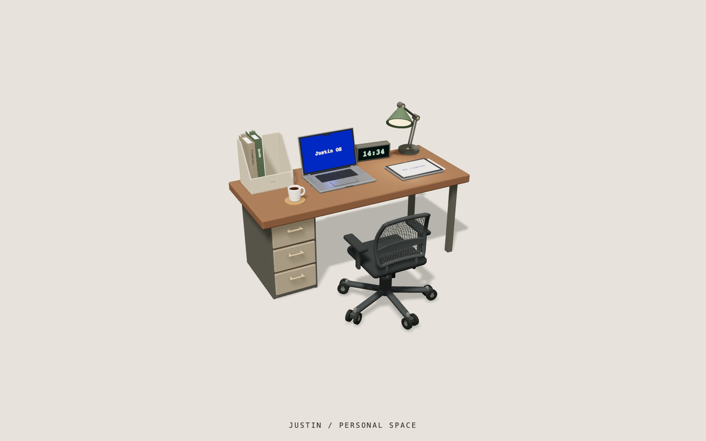

<p align="center"><strong>JustinSpace 是一个以交互式 3D 工作室为入口的个人空间网站</strong></p>

<p align="center">
  
</p>

<p align="center">
  <a href="https://nodejs.org/"></a>
  <a href="https://astro.build/"></a>
  <a href="https://react.dev/"></a>
  <a href="https://threejs.org/"></a>
  <br>
  <a href="#页面">页面</a> ·
  <a href="#本地开发">本地开发</a> ·
  <a href="docs/README.md">项目文档</a> ·
  <a href="CHANGELOG.md">变更记录</a> ·
  <a href="https://github.com/zhouycheng/personal-space-web/issues">问题反馈</a>
</p>

JustinSpace 用 Astro、React 和 Three.js 展示个人作品、日记与文件。项目名为 JustinSpace，GitHub 仓库和 GHCR 镜像使用 `personal-space-web`。

## 页面

- `/home`：可交互的 Three.js 工作室。
- `/works`：项目作品和简历。
- `/canvas`：可拖动浏览的个人画布。
- `/os`：文件驱动的桌面与窗口。
- `/journal`：实体翻页效果的 3D 日记。

## 本地开发

使用 `.node-version` 指定的 Node.js（当前为 `26.9.0`，运行要求 `>=22.12.0`）：

```bash
npm ci
npm run dev
```

常用检查：

```bash
npm run check:boundaries
npm run check:types
npm run test:unit
npm run build
```

日记书页生成、浏览器测试和性能检查见[日记说明](docs/features/journal.md)。源码职责见[架构说明](docs/develop/architecture.md)，所有项目文档见[文档索引](docs/README.md)。

## 部署与活动监听

生产环境推荐使用 Docker 镜像部署；首次安装、服务器环境、密钥注入、自动更新和回滚步骤见[部署手册](docs/develop/deployment.md)。

macOS 活动监听器安装与配置：

```bash
npm run monitor:install
justin-activity config
justin-activity restart
justin-activity status
```

监听器会在当前用户登录后启动。部署端 token、故障排查和完整命令见[部署手册](docs/develop/deployment.md)与[监听器说明](src/justin-kit/components/local-activity-status/README.md)。

## 授权

网站自有代码使用 [Zlib](LICENSE)。真实简历、日记、头像、作品资料和其他个人内容保留权利；第三方材料沿用其原许可。Fork 后可修改网站代码并替换个人资料。完整范围见[授权说明](legal/LICENSING.md)、[个人内容许可](legal/CONTENT-LICENSE.md)和[第三方材料清单](legal/THIRD_PARTY_NOTICES.md)。
